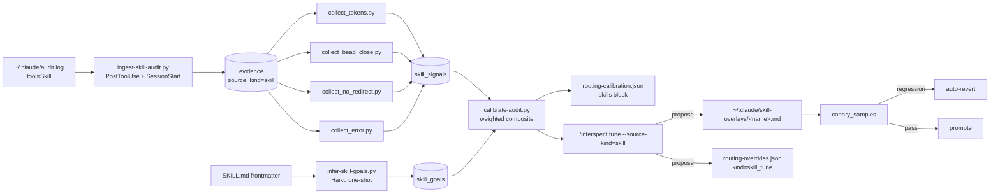

# Interspect Skill Calibration — Implementation Plan

> **For Claude:** REQUIRED SUB-SKILL: Use `clavain:executing-plans` to
> implement this plan task-by-task.

**Bead:** sylveste-7aj8 (epic) — children sylveste-7aj8.1 (schema, includes source_kind port prereq) through sylveste-7aj8.7 (canary + autonomy)
**Goal:** Generalize `interspect` from `source_kind='agent'` to
`{agent, skill}` so that every Claude Code Skill invocation feeds an
autonomous tune-and-canary loop.

**Architecture:** `~/.claude/audit.log` already captures every Skill
invocation (per `docs/contracts/audit-log-schema.md`). This plan drains that
log into the existing `interspect.db` evidence store under a new
`source_kind='skill'`, adds four signal collectors that aggregate quality
evidence, infers per-skill goal weights from SKILL.md, computes a composite
score, and reuses the existing canary / autonomy / tune-overlay machinery to
write skill overlays at `~/.claude/skill-overlays/<skill-name>.md`.

**Tech Stack:** Bash (`lib-interspect.sh`), SQLite (`interspect.db`), Python
(collectors, classifier), jq, JSON, the existing
`docs/contracts/routing-contract.md` artifact format.

**Repo scope:** The bulk of code lands in the sibling
`mistakeknot/interspect` repo (Sylveste gitignores `interverse/`). This plan
file lives in `mistakeknot/sylveste` as the design record; implementation
PRs target the interspect repo and reference this plan.

## Signal pipeline



## Must-Haves

**Truths** (observable behaviors):
- Every `Skill` row in `~/.claude/audit.log` produces one `evidence` row
  with `source_kind='skill'` within one PostToolUse cycle
- Each skill invocation accumulates up to four `skill_signals` rows
  (`tokens`, `bead_close`, `no_redirect`, `error`) over its outcome window
- `routing-calibration.json` includes a `skills` block sibling to `agents`,
  populated for skills with ≥10 invocations in trailing 30 days
- Under `/interspect:enable-autonomy`, a `tighten_description` patch
  auto-applies under canary; a SKILL.md body rewrite never does
- A simulated 20% signal regression in `canary_samples` triggers
  auto-revert; the modification row's `state` becomes `reverted`

**Artifacts** (files that must exist):
- `interverse/interspect/hooks/lib-interspect.sh` — extends `_interspect_ensure_db` with `skill_goals` + `skill_signals`, source_kind allowed list adds `skill`
- `interverse/interspect/scripts/ingest-skill-audit.py` — new
- `interverse/interspect/scripts/signals/collect_{tokens,bead_close,no_redirect,error}.py` — new
- `interverse/interspect/scripts/infer-skill-goals.py` — new
- `interverse/interspect/scripts/calibrate-audit.py` — skill scoring block added
- `interverse/interspect/commands/interspect-{tune,status,propose,effectiveness,approve,revert,health}.md` — `--source-kind=skill` paths added
- `.claude-plugin/plugin.json` — minor version bumped
- `tests/shell/test_skill_evidence.sh`, `test_skill_tune.sh` — new

**Key Links:**
- Existing schema migration block sits inside `_interspect_ensure_db` in
  `lib-interspect.sh`
- Existing scoring block at `calibrate-audit.py:50-72` writes
  `routing-calibration.json` for agents — extend with parallel skill block
- Existing autonomy gate is the `/interspect:enable-autonomy` flow
- Existing canary table is `canary_samples`
- Audit-log schema authority: `docs/contracts/audit-log-schema.md` (this PR
  adds a Downstream Consumer line — no schema change)
- Routing-overrides contract authority: `docs/contracts/routing-contract.md`
  — extended additively with `kind: "skill_tune"`

---

### Task 1: Schema delta — `skill_goals` + `skill_signals`

**Files:**
- Modify: `interverse/interspect/hooks/lib-interspect.sh` (in the sibling
  `mistakeknot/interspect` repo — see Repo scope above)

**Step 0 (prereq, discovered 2026-06-17):** The sibling `mistakeknot/interspect`
repo's `lib-interspect.sh` does NOT yet have the `source_kind` column — that
addition (`sylveste-sfhq.1`, telemetry fusion) lives only in the Sylveste
monorepo copy at `interverse/interspect/hooks/lib-interspect.sh:114-118`.
Before extending the allowed values in Step 2, **port the column itself**:

```sql
ALTER TABLE evidence ADD COLUMN source_kind TEXT NOT NULL DEFAULT 'agent';
CREATE INDEX IF NOT EXISTS idx_evidence_source_kind ON evidence(source_kind, source);
```

Inline the ALTER inside `_interspect_ensure_db` next to the existing
`source_event_id` ALTER, guarded by `|| true` for idempotency. Update the
CHECK list documented in the comment block to `('agent','tool','pattern')`
initially — Step 2 widens it to include `'skill'`.

**Step 1:** Locate `_interspect_ensure_db` and the existing `CREATE TABLE`
block. Append the two new tables idempotently:

```sql
CREATE TABLE IF NOT EXISTS skill_goals (
    skill_name TEXT PRIMARY KEY,
    goal_weights TEXT NOT NULL,
    classified_from TEXT NOT NULL,
    classifier_version TEXT NOT NULL,
    classified_at TEXT NOT NULL,
    skill_md_hash TEXT
);

CREATE TABLE IF NOT EXISTS skill_signals (
    id INTEGER PRIMARY KEY AUTOINCREMENT,
    skill_name TEXT NOT NULL,
    session_id TEXT NOT NULL,
    invocation_id TEXT NOT NULL,
    signal_kind TEXT NOT NULL,
    value REAL NOT NULL,
    raw_value REAL,
    observed_at TEXT NOT NULL,
    metadata TEXT,
    UNIQUE(invocation_id, signal_kind)
);
CREATE INDEX IF NOT EXISTS idx_skill_signals_name
  ON skill_signals(skill_name, signal_kind);
CREATE INDEX IF NOT EXISTS idx_skill_signals_session
  ON skill_signals(session_id);
```

**Step 2:** In `_interspect_insert_evidence`, extend the allowed-values list
for `source_kind` to include `skill` (the existing CHECK is in-line with the
INSERT; the comment block at `lib-interspect.sh:115-117` documents the
allowed set — update it to `agent | tool | pattern | skill`).

**Step 3:** Add `sessions.last_skill_audit_ts` column (idempotent `ALTER
TABLE ... ADD COLUMN` guarded by a `PRAGMA table_info` probe).

<verify>
- run: `bash -n interverse/interspect/hooks/lib-interspect.sh`
  expect: exit 0
- run: `sqlite3 /tmp/test-interspect.db < migration.sql && sqlite3 /tmp/test-interspect.db .schema | grep -c "skill_goals\\|skill_signals"`
  expect: 2
</verify>

### Task 2: Audit-log ingestion — `ingest-skill-audit.py`

**Files:**
- New: `interverse/interspect/scripts/ingest-skill-audit.py`
- Modify: `interverse/interspect/hooks/interspect-evidence.sh` — invoke ingest
- Modify: `interverse/interspect/hooks/interspect-session.sh` — invoke ingest at SessionStart

**Step 1:** The script tails `~/.claude/audit.log` (and the rotated
`audit.log.1.gz`) from the watermark stored in `sessions.last_skill_audit_ts`.
For each line where `tool == "Skill"`:

1. Compute `invocation_id = sha1(ts + session_id + name)[:16]`
2. Insert one `evidence` row with `source_kind='skill'`,
   `source=<name>`, `verdict='neutral'`, `event='skill_invocation'`,
   metadata carrying `duration_ms` and `exit_code`
3. Insert one `skill_signals` row with `signal_kind='error'`,
   `value = (1.0 if exit_code == 0 else 0.0)`,
   `raw_value=exit_code` — relies on `(invocation_id, signal_kind)` UNIQUE
4. Update `sessions.last_skill_audit_ts` to the row's `ts`

**Step 2:** Add a `--since=<duration>` flag for backfill (`30d`, `7d`, etc.).

**Step 3:** Wire into `interspect-evidence.sh` PostToolUse and
`interspect-session.sh` SessionStart hooks.

<verify>
- run: `python3 interverse/interspect/scripts/ingest-skill-audit.py --since=7d --dry-run`
  expect: prints projected row count, exit 0
- run: `sqlite3 .clavain/interspect/interspect.db "SELECT COUNT(*) FROM evidence WHERE source_kind='skill';"`
  expect: matches dry-run count after live run
</verify>

### Task 3: Signal collectors

**Files:**
- New: `interverse/interspect/scripts/signals/collect_tokens.py`
- New: `interverse/interspect/scripts/signals/collect_bead_close.py`
- New: `interverse/interspect/scripts/signals/collect_no_redirect.py`
- New: `interverse/interspect/scripts/signals/collect_error.py` (no-op if
  ingestion already wrote it; kept as catch-up runner)
- Modify: `interverse/interspect/commands/calibrate.md` — add `signals` step

**Step 1:** Each collector reads pending `evidence` rows (where the
corresponding `(invocation_id, signal_kind)` is missing from
`skill_signals`) and writes the signal row.

**`collect_tokens.py`:**
- Join per-session CASS analytics (`os/Alwe`) on `session_id`
- For each skill invocation, compute marginal `delta_tokens` vs.
  counterfactual baseline: sessions in the same project, ±7 days, with no
  invocation of this skill, bucketed by intent class (use the existing
  `_interspect_intent_class` helper or the audit-summary intent bucket)
- Normalize: `value = 1 - sigmoid(delta_tokens / baseline_std)`
- Write `signal_kind='tokens'`

**`collect_bead_close.py`:**
- For each skill invocation, find the bead `in_progress` at invocation time
  (read `.beads/issues.jsonl` directly per the cloud-session pattern in
  `CLAUDE.md`)
- Check the bead's state within 7 days: `resolved` → 1.0,
  `deferred|rejected` → 0.0, still open → skip (pending; re-run picks up
  later)
- Write `signal_kind='bead_close'`

**`collect_no_redirect.py`:**
- Locate the session JSONL in `~/.claude/projects/`
- Read the next 5 user turns post-invocation
- Detect redirect markers via regex on `\b(/clear|wait|stop|actually|instead|redo|that's wrong|don't|undo)\b`
- `value = 1 - redirect_density` where density is markers-per-turn capped at 1
- Write `signal_kind='no_redirect'`

**`collect_error.py`:**
- Catch-up runner — fills in rows that ingestion missed (idempotent via
  UNIQUE)

**Step 2:** Wire into the calibrate flow — `commands/calibrate.md` invokes
each collector before scoring; SessionStart runs slow signals async.

<verify>
- run: `python3 interverse/interspect/scripts/signals/collect_error.py`
  expect: exit 0; row count matches `evidence WHERE source_kind='skill' AND no signal row exists`
- run: invoke a tracked skill in a test session, then run calibrate
  expect: up to 4 rows land within one cycle (tokens may be NULL pending CASS join)
</verify>

### Task 4: Per-skill goal inference

**Files:**
- New: `interverse/interspect/scripts/infer-skill-goals.py`

**Step 1:** Enumerate skills from `~/.claude/plugins/*/skills/*/SKILL.md`
and `.claude/skills/*/SKILL.md`. For each:
1. Compute SKILL.md content hash
2. Short-circuit if `skill_goals.skill_md_hash` matches

**Step 2:** Single Haiku call (`claude -p`) per skill needing classification:
- Input: SKILL.md frontmatter + first 2KB body
- Few-shot prompt examples:
  - Retrieval skill (e.g., `intersearch`) → speed-leaning
    `{speed:0.7, precision:0.2, completeness:0.1}`
  - Reasoning skill (e.g., `clavain:work`) → precision-leaning
    `{speed:0.2, precision:0.6, completeness:0.2}`
  - Audit skill (e.g., `quality-gates`) → completeness-leaning
    `{speed:0.1, precision:0.3, completeness:0.6}`
- Output: JSON `{"speed":w1, "precision":w2, "completeness":w3}` summing to 1
- Persist to `skill_goals` with `classified_from='skill_md'`,
  `classifier_version=<sha of this script>`, `classified_at=<now>`,
  `skill_md_hash=<hash>`

**Step 3:** Refinement pass — for skills with ≥20 invocations and existing
`skill_goals` row, compute observed signal mix
(`signal_mean[k] / Σ signal_mean[k]`) and blend with classifier weights via
EMA (α=0.3). Update row with `classified_from='observed'`.

**Step 4:** Add weekly cron entry (use existing Sylveste cron infra at
`ops/cron/`) and a `--skill <name>` flag for on-demand from
`/interspect:status`.

<verify>
- run: `python3 interverse/interspect/scripts/infer-skill-goals.py --skill clavain:work`
  expect: prints weight JSON, persists row
- run: same command again
  expect: short-circuits on hash match
</verify>

### Task 5: Weighted scoring in `calibrate-audit.py`

**Files:**
- Modify: `interverse/interspect/scripts/calibrate-audit.py`
- Modify: `interverse/interspect/commands/calibrate.md` — display block

**Step 1:** After the existing agent scoring block (around
`calibrate-audit.py:50-72`), add the skill scoring block:

1. Query skills with ≥10 invocations in trailing 30 days
2. For each, recency-weighted-mean each signal (reuse existing decay helper)
3. Compose: `score = Σ goal_weights[k] × (Σ_j signal_j → goal_k) / N_j`
4. Signal-to-goal mapping:
   - `tokens` → `speed`
   - `error` → `precision`
   - `no_redirect` → `precision` (with 0.5x weight to avoid double-counting)
   - `bead_close` → `completeness`

**Step 2:** Write a `skills` block in `routing-calibration.json` sibling to
`agents`:

```json
{
  "schema_version": 3,
  "agents": { ... existing ... },
  "skills": [
    {"skill": "clavain:campaign",
     "invocations_30d": 47,
     "score": 0.82,
     "signals": {"tokens": 0.78, "error": 0.95,
                 "no_redirect": 0.81, "bead_close": 0.68},
     "goal_weights": {"speed": 0.5, "precision": 0.3, "completeness": 0.2},
     "classified_from": "observed"}
  ]
}
```

**Step 3:** Reuse the existing snapshot-history machinery for skill drift
detection (bump `schema_version` to 3; downstream consumers should ignore
unknown fields per the schema's additive convention).

<verify>
- run: `python3 interverse/interspect/scripts/calibrate-audit.py`
  expect: `routing-calibration.json` has `skills` block; `schema_version` 3
- run: `jq '.skills | length' .clavain/interspect/routing-calibration.json`
  expect: ≥1 (assuming any skill cleared 10 invocations)
</verify>

### Task 6: Tune overlays — extend command + overlay file format

**Files:**
- Modify: `interverse/interspect/commands/interspect-tune.md`
- Modify: `interverse/interspect/hooks/lib-interspect.sh` — add
  `_interspect_generate_skill_overlay`, `_interspect_apply_skill_overlay`

**Step 1:** `interspect-tune.md` accepts `--source-kind=skill`. When set, the
flow:
1. Validate skill name; ensure `skill_goals` row + ≥10 signals
2. Determine action based on which signal dominates the regression:
   - High `no_redirect` deficit → `tighten_description` or `when_to_use_add`
   - High `tokens` deficit → `when_to_use_add` (negative trigger examples)
   - High `error` deficit → `skill_md_body_rewrite` (propose only)
   - Low utilization + good signals → `availability` adjustment (propose only)
3. Generate the patch via Haiku — input is the goal-weighted signal report +
   the worst-performing invocations' redirect markers / error contexts
4. Write a row in `routing-overrides.json` with `kind: "skill_tune"`

**Step 2:** Overlay file format at
`~/.claude/skill-overlays/<plugin>:<skill>.md`:

```markdown
---
overlay_for: <plugin>:<skill>
generated_by: interspect:tune
generated_at: <iso8601>
evidence_ids: [123, 456]
canary_until: <iso8601>
---
## description-overlay
<patched description>

## when-to-use-overlay
<additions; do not duplicate>
```

The Claude Code skill loader merges the overlay over the source SKILL.md;
the merge precedent and loader plumbing matches the existing agent overlays.

**Step 3:** Apply path branches on autonomy mode:
- Autonomy on + action in safe-list (`tighten_description`,
  `when_to_use_add`) → auto-apply, enter canary
- Otherwise → propose only

<verify>
- run: `interspect:tune --skill clavain:work --dry-run`
  expect: prints proposed patch, no file written
- run: `interspect:tune --skill clavain:work --source-kind=skill --apply` with autonomy off
  expect: writes proposal to `routing-overrides.json`, no overlay file
</verify>

### Task 7: Canary + autonomy for skills

**Files:**
- Modify: `interverse/interspect/hooks/lib-interspect.sh` — extend
  canary-sample collection
- Modify: `interverse/interspect/commands/interspect-{propose,approve,revert,status,effectiveness,health}.md` —
  `--source-kind=skill` filter

**Step 1:** When a skill overlay enters active state, the next 20 invocations
or 14 days of `skill_signals` rows are tagged as canary samples in
`canary_samples` (skill_name + modification_id + per-signal delta vs.
pre-overlay baseline).

**Step 2:** Regression trigger evaluated at each calibrate cycle: any
individual signal regresses by >20% AND composite score regresses by >10%.
If triggered, reuse the existing modification revert path — overlay file is
removed, `routing-overrides.json` row's `state` flips to `reverted`.

**Step 3:** Per-action autonomy safe-list lives in
`.clavain/interspect/skill-autonomy-policy.json`:

```json
{
  "auto_apply": ["tighten_description", "when_to_use_add"],
  "propose_only": ["skill_md_body_rewrite", "availability"]
}
```

**Step 4:** Each command grows a `--source-kind=skill` filter:
- `/interspect:propose --source-kind=skill` — list ready skill patterns
- `/interspect:approve --source-kind=skill <id>`
- `/interspect:revert --source-kind=skill <id>`
- `/interspect:status` — adds Skills section
- `/interspect:effectiveness --source-kind=skill` — per-skill score delta
  over time
- `/interspect:health --source-kind=skill` — signal coverage diagnostics

<verify>
- run: simulate 20% regression in canary samples, then calibrate
  expect: modification row `state='reverted'`, overlay file removed
- run: with `/interspect:enable-autonomy`, propose a `tighten_description` patch
  expect: auto-applies under canary
- run: with `/interspect:enable-autonomy`, propose a `skill_md_body_rewrite` patch
  expect: remains in proposed state (per safe-list)
</verify>

### Task 8: Tests

**Files:**
- New: `interverse/interspect/tests/shell/test_skill_evidence.sh`
- New: `interverse/interspect/tests/shell/test_skill_tune.sh`

Mirror the dual-mode pattern in the existing `test_tune_dual_mode.sh`:
- Set up a fixture audit.log with synthesized Skill rows
- Run ingestion + collectors + scoring
- Assert rows land, scoring composes, tune overlay generates, autonomy
  gate enforces safe-list, canary auto-reverts on simulated regression

### Task 9: Docs

**Files:**
- Modify: `interverse/interspect/AGENTS.md`, `CLAUDE.md`, `README.md` —
  document the skill calibration loop and the tool-time boundary
- Modify: `interverse/interspect/.claude-plugin/plugin.json` — minor version
  bump

---

## Verification (end-to-end)

1. **Schema migration** — `sqlite3 .clavain/interspect/interspect.db .schema`
   shows `skill_goals` and `skill_signals`. Existing rows unaffected.
2. **Backfill** — `python3 scripts/ingest-skill-audit.py --since=30d`;
   `SELECT source, COUNT(*) FROM evidence WHERE source_kind='skill' GROUP BY source ORDER BY 2 DESC LIMIT 10`
   shows top skills.
3. **Goal inference** —
   `python3 scripts/infer-skill-goals.py --skill clavain:work` returns
   weight JSON; second call short-circuits on hash match.
4. **Signals end-to-end** — invoke a tracked skill in a test session;
   within one calibrate cycle, four `skill_signals` rows land (tokens may
   be NULL until CASS data joins).
5. **Scoring** — `routing-calibration.json` has a `skills` block;
   `interspect:effectiveness --source-kind=skill` renders a leaderboard.
6. **Tune dry-run** — `interspect:tune --skill <name> --dry-run` emits
   proposed patch without writing the overlay.
7. **Canary regression test** — extend `tests/shell/test_tune.sh` for the
   skill source_kind; reuse the dual-mode pattern from
   `test_tune_dual_mode.sh`.
8. **Autonomous gate** — with `/interspect:enable-autonomy`, a
   `tighten_description` patch auto-applies; a `skill_md_body_rewrite`
   proposal does not.
9. **Revert** — simulated 20% signal regression in canary samples triggers
   auto-revert; modification row state moves to `reverted`.
10. **No tool-time conflict** — tool-time continues to write its
    `events.jsonl`; interspect reads only `~/.claude/audit.log`.

## Alignment / Conflict (per PHILOSOPHY.md protocol)

- **Alignment:** Generalizes interspect from agent routing to skill
  routing, closing the measurement loop the platform already opened with
  audit.log capture; no new pillar required.
- **Conflict/Risk:** Slow signals (`bead_close`, `no_redirect`) operate on
  7-day-plus windows — operators need to expect lag between an SKILL.md
  edit and a calibration verdict. Documented as a Non-goal in the PRD.
